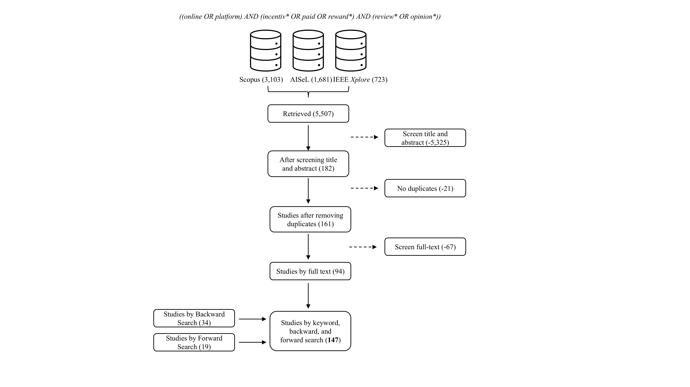

# Supplemental Material for *Incentivizing Online Reviews: A Framework and Systematic Literature Review of Strategies and Effects*

This repository contains the supplemental materials accompanying the manuscript *Incentivizing Online Reviews: A Framework and Systematic Literature Review*. The repository provides the complete study sample, coding scheme, coding results for psychological and behavioral outcome, and publication outlet information.

## Repository Contents

## Literature Search Process

The systematic literature search and study selection process is illustrated below. The final set of included studies corresponds to the dataset provided in [`systematic_review_complete_sample.csv`](./systematic_review_complete_sample.csv).



*Figure 1. Study selection process.*


### [`systematic_review_complete_sample.csv`](./systematic_review_complete_sample.csv)

Contains the complete sample of publications (N=147) included in the systematic literature review. For each publication, the dataset reports the search strategy through which the study was identified, bibliographic information (title, authors, publication year), study characteristics (empirical/theoretical), as well as the investigated incentives.

---

### [`coding_scheme.csv`](./coding_scheme.csv)

Contains the complete coding scheme applied during the systematic literature review. The file documents the coding categories, constructs, and operational definitions that guided the coding process.

This coding scheme served as the basis for coding the investigated outcomes in every study contained in [`systematic_review_complete_sample.csv`](./systematic_review_complete_sample.csv).

---

### [`coding_psychological_outcome.csv`](./coding_psychological_outcome.csv)

Contains the coding for psychological outcomes identified in the reviewed literature. The effect-direction codes indicate how an incentive or incentivizing strategy is associated with the respective psychological outcome.
| Effect Direction | Description |
|------------------|-------------|
| **+** | The incentivizing strategy or incentive has a positive effect on the psychological outcome (i.e., increases or strengthens the outcome). |
| **−** | The incentivizing strategy or incentive has a negative effect on the psychological outcome (i.e., decreases or weakens the outcome). |
| **+/−** | The study reports both positive and negative effects, for example, depending on the incentive types. |
| **0** | No statistically significant effect on the psychological outcome is reported. |
| **NA** | No relationship is examined or reported. |

---

### [`psychological_outcome_categories.csv`](./psychological_outcome_categories.csv)

Psychological outcomes were grouped according to their dominant psychological function. The file groups individual psychological outcome constructs into seven broader conceptual categories (e.g., cognitive and belief-based responses, affective responses, normative and moral evaluations, and personal motivational processes) and provides a definition for each category.

---
### [`coding_behavioral_outcome.csv`](./coding_behavioral_outcome.csv)

Contains the coding for behavioral outcomes identified in the reviewed literature. The effect-direction codes indicate how an incentive or incentivizing strategy is associated with the respective behavioral outcome.
| Effect Direction | Description |
|------------------|-------------|
| **+** | The incentivizing strategy or incentive has a positive effect on the behavioral outcome (i.e., increases or strengthens the outcome). |
| **−** | The incentivizing strategy or incentive has a negative effect on the behavioral outcome (i.e., decreases or weakens the outcome). |
| **+/−** | The study reports both positive and negative effects, for example, depending on the incentive types. |
| **0** | No statistically significant effect on the behavioral outcome is reported. |
| **NA** | No relationship is examined or reported. |
---

### [`outlets_journals.csv`](./outlets_journals.csv)

Contains all journals represented in the final study sample. For each journal, the file reports:

- **SJR (SCImago Journal Rank) quartile**
- **VHB-JOURQUAL 3 ranking**
- **ABS Academic Journal Guide ranking**
- **Frequency**, indicating the number of studies published in the respective journal that were included in the systematic literature review.

#### Journal Ranking Summary

**SJR Ranking**

| Ranking | Frequency |
|---------|----------:|
| Q1 | 98 |
| Q2 | 9 |
| Q3 | 4 |
| Q4 | 1 |
| Not listed | 1 |

**VHB-JOURQUAL 3**

| Ranking | Frequency |
|---------|----------:|
| A+ | 14 |
| A | 3 |
| B | 24 |
| C | 4 |
| Not listed | 69 |

**ABS Academic Journal Guide**

| Ranking | Frequency |
|---------|----------:|
| 1 | 17 |
| 2 | 21 |
| 3 | 30 |
| 4 | 9 |
| 4* | 20 |
| Not listed | 16 |

---

### [`outlets_conferences.csv`](./outlets_conferences.csv)

Contains all conferences represented in the final study sample. For each conference, the file reports:

- **VHB conference ranking** (where available)
- **Frequency**, indicating the number of studies published in the respective conference proceedings that were included in the systematic literature review.

Conferences that are not covered by the VHB ranking are reported as **Not listed**.

#### Conference Ranking Summary

| VHB Ranking | Frequency |
|------------|----------:|
| A | 6 |
| B | 3 |
| C | 10 |
| Not listed | 12 |

## Repository Structure

```text
                    search_strategy.png
                             │
                             ▼
             systematic_review_complete_sample.csv
                             │
                             ▼
                    coding_scheme.csv
                             │
              ┌──────────────┴──────────────┐
              ▼                             ▼
  psychological_outcome_            coding_behavioral_
      categories.csv                    outcome.csv
              │
              ▼
    coding_psychological_
         outcome.csv
```

## Workflow

The files are intended to be used together:

1. **`search_strategy.png`** illustrates the systematic literature search and study selection process that resulted in the final study sample.
2. **`systematic_review_complete_sample.csv`** documents the complete set of studies included in the review.
3. **`coding_scheme.csv`** specifies the coding framework applied to all included studies.
4. **`psychological_outcome_categories.csv`** provides the conceptual classification of psychological outcomes into higher-level categories.
5. **`coding_psychological_outcome.csv`** contains the detailed coding for individual psychological outcome constructs.
6. **`coding_behavioral_outcome.csv`** contains the detailed coding for behavioral outcome constructs.
7. **`outlets_journals.csv`** and **`outlets_conferences.csv`** provide journal and conference ranking information

Together, these materials provide transparent documentation of the selected studies and coding procedures and facilitate transparency and reuse of the systematic literature review.
